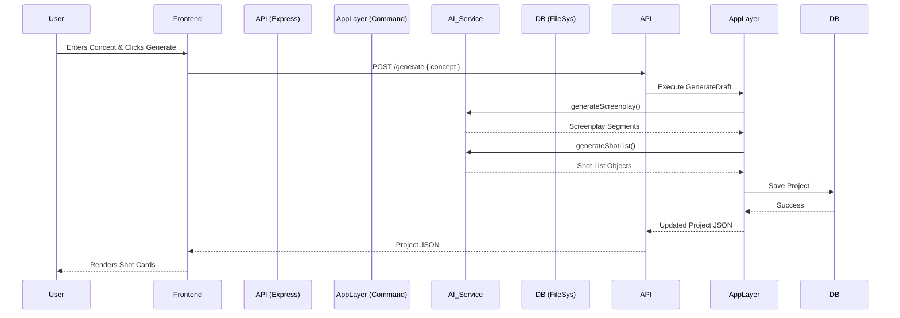

# AI Video Orchestrator System Documentation

## 1. System Overview

The AI Video Orchestrator is a specialized multi-agent platform designed to automate the creative process of video production. It takes a high-level concept from a user and orchestrates a workflow that transitions from a **Screenplay** to a **Shot List**, and finally to **Rendered Video Assets**.

The system is built on **Pragmatic Domain-Driven Design (DDD)** principles, ensuring a clean separation between business rules, orchestration logic, and external infrastructure (AI & Video APIs).

## 2. Architecture (Backend)

The backend is hosted in `/examples/backend` and is built with **Node.js**, **Express**, and **TypeScript**. It follows a strict layered architecture.

### 2.1 Layered Structure

1.  **Domain Layer** (`src/domain`)
    *   **Responsibility**: Contains the core business logic and types. It has *zero dependencies* on frameworks or external tools.
    *   **Key Entities**:
        *   `Project`: The Aggregate Root. Holds the state (`DRAFT`, `RENDERING`, etc.), the Screenplay, and the Shot List.
        *   `Shot`: Represents a single video segment with a visual prompt, status, and metadata.
    *   **Repositories**: Defines interfaces (e.g., `IProjectRepository`) for data access, implemented in the Infrastructure layer.

2.  **Application Layer** (`src/application`)
    *   **Responsibility**: Orchestrates the flow of data. It contains **Commands** (Use Cases) that manipulate Domain Entities.
    *   **Key Commands**:
        *   `GenerateDraft`: Calls the AI Service to create a screenplay and shot list.
        *   `UpdateShotInstruction` (Agentic): Interprets natural language instructions to rewrite a specific shot.
        *   `CommitAndRender`: Locks the project and triggers the video rendering process.
    *   **Interfaces**: Defines ports for external services (`IAIService`, `IVideoRenderer`).

3.  **Infrastructure Layer** (`src/infrastructure`)
    *   **Responsibility**: Implements the interfaces defined in inner layers.
    *   **Adapters**:
        *   `FileSystemProjectRepository`: Saves projects to a local JSON file (`data/projects.json`).
        *   `MockAIAdapter`: Simulates an LLM (like OpenAI) to generate scripts and prompts.
        *   `MockVeoAdapter`: Simulates a Video Generation API (like Google Veo) with artificial delays.

4.  **Interface Layer** (`src/server.ts`)
    *   **Responsibility**: Exposes the Application functionalities via a REST API.

### 2.2 The "Agentic Loop" vs. Manual Control

A key feature of this architecture is the distinction between manual user overrides and AI-driven agentic actions.

| Feature | Endpoint | Flow |
| :--- | :--- | :--- |
| **Manual Edit** | `PATCH /shots/:id` | User types in text box -> Frontend saves on blur -> Updates DB directly. No AI involved. |
| **Agentic Refine** | `PUT /shots/:id` | User clicks "Refine" -> Sends instruction ("Make it darker") -> **AI Service** interprets & rewrites the prompt -> DB Updated. |

### 2.3 API Endpoints

*   `POST /api/projects`: Initialize a new empty project.
*   `POST /api/projects/:id/generate`: Generate a draft based on a concept.
*   `PUT /api/projects/:id/shots/:shotId`: Agentic refinement of a shot.
*   `PATCH /api/projects/:id/shots/:shotId`: Manual update of a shot's prompt.
*   `POST /api/projects/:id/render`: Commit all shots and start rendering.
*   `GET /api/projects/:id`: Fetch current project state (used for polling).

---

## 3. Frontend (Dashboard)

The frontend is a "Glass Box" implementation located in `/examples/dashboard`. It is built with **Vanilla HTML, CSS, and JavaScript**, intentionally avoiding complex frameworks to demonstrate the logic clearly.

### 3.1 State Management

The application uses a simple global state object:
```javascript
const state = {
    projectId: null,
    project: null,
    isProcessing: false
};
```
All UI updates are driven by this state. When data changes, `renderShotList()` clears the DOM and rebuilds it based on the current JSON state.

### 3.2 User Flow

1.  **Initialization**: User clicks "Initialize Project". A new session is created on the backend.
2.  **Concept Input**: User enters a campaign idea (e.g., "Cyberpunk coffee commercial").
3.  **Generation**: The backend returns a generated **Shot List**.
4.  **Refinement**:
    *   User can manually edit the text in any text area (saves on blur).
    *   User can click "✨ Refine" to ask the AI to make specific changes to that shot.
5.  **Rendering**: User clicks "Commit & Render". The status changes to `RENDERING`.
6.  **Polling**: The frontend enters a polling loop, checking `GET /api/projects/:id` every 2 seconds until the status is `COMPLETED`.
7.  **View**: Once completed, "View Video" links appear for each shot.

---

## 4. Data Flow Diagram


